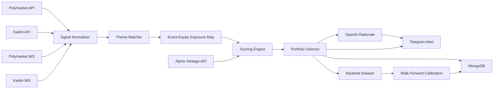

# Architecture

## Data collections
- `prediction_signals`: raw normalized market signals with TTL.
- `candidate_ideas`: scored ideas with factor breakdown.
- `equity_cache`: fundamentals/quote cache with freshness checks.
- `equity_daily_bars`: cached historical close prices for backtest.
- `alerts`: dedupe digest + sent metadata.
- `backtest_reports`: calibration and validation summaries.

## Reliability controls
- HTTP retries with exponential backoff.
- Dedup by `(source, market_id)` and recent-update preference.
- Alert cooldown via Mongo digest hash.
- Stream queue backpressure with bounded buffer.
- Dry-run mode for safe testing in production environment.
